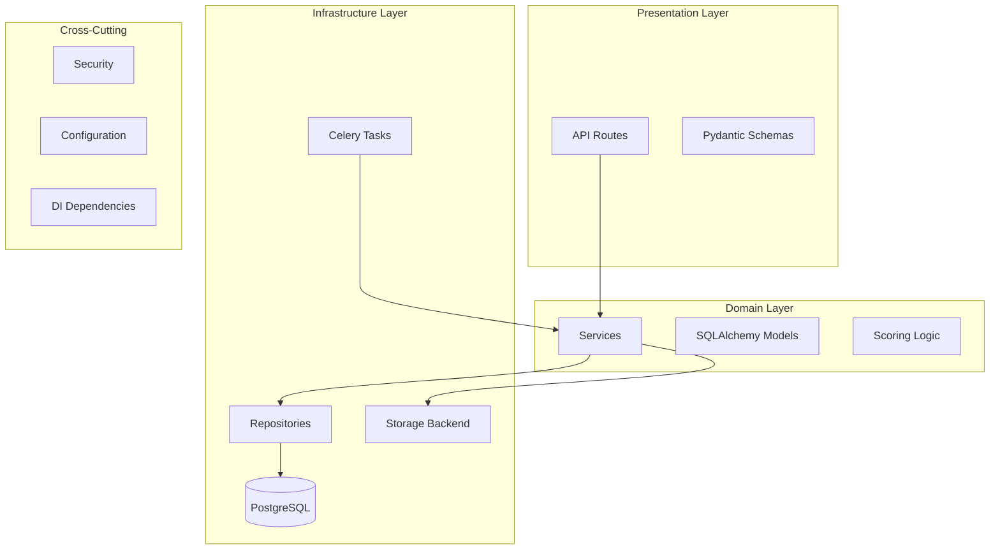
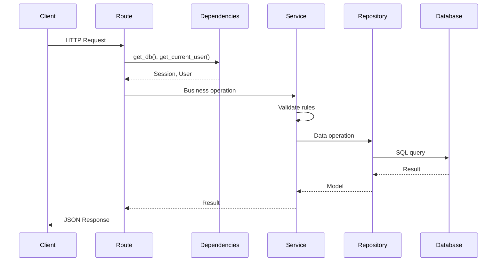
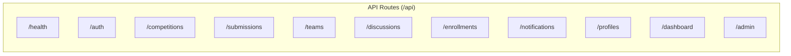
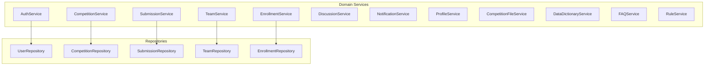
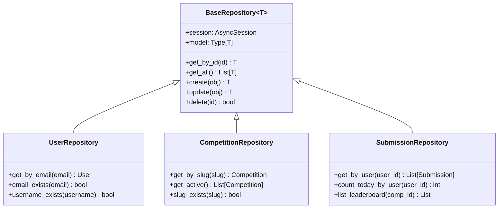
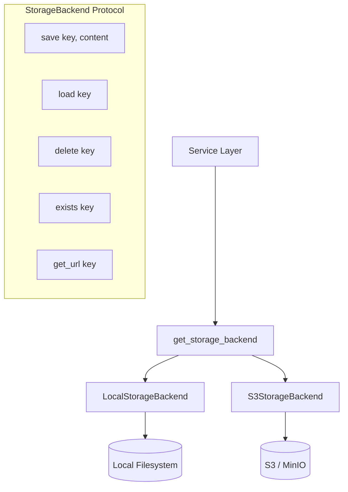
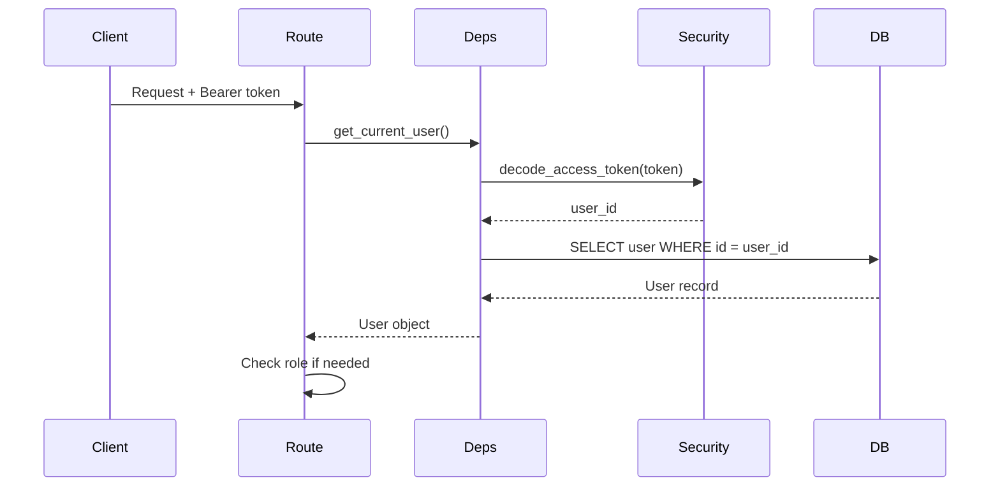
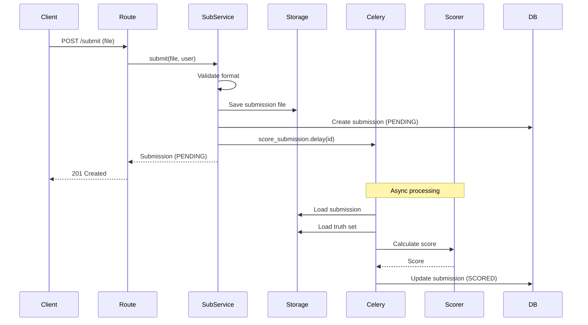

# Backend Architecture

FastAPI application with layered architecture, async database operations, and pluggable storage.

## Technology Stack

| Technology | Purpose |
|------------|---------|
| FastAPI | Web framework |
| SQLAlchemy 2.0 | ORM (async) |
| PostgreSQL | Database |
| Alembic | Migrations |
| Pydantic | Validation |
| JWT + bcrypt | Authentication |
| Celery + Redis | Task queue |

## Layered Architecture



## Directory Structure

```
backend/src/
├── api/
│   ├── routes/           # HTTP endpoints
│   ├── schemas/          # Request/response models
│   └── dependencies.py   # Dependency injection
├── domain/
│   ├── models/           # SQLAlchemy ORM models
│   ├── services/         # Business logic
│   └── scoring/          # Submission scoring
├── infrastructure/
│   ├── repositories/     # Data access layer
│   ├── storage/          # File storage (local/S3)
│   ├── tasks/            # Celery async tasks
│   └── database.py       # DB connection
├── common/
│   ├── security.py       # Auth utilities
│   └── utils.py          # Shared utilities
├── config.py             # Settings
└── main.py               # App entrypoint
```

## Request Flow



## API Routes



### Route Endpoints

| Route | Key Endpoints |
|-------|---------------|
| `/health` | `GET /live`, `GET /ready` |
| `/auth` | `POST /register`, `POST /login`, `GET /me` |
| `/competitions` | CRUD, `POST /{slug}/thumbnail`, `POST /{slug}/truth-set` |
| `/submissions` | `POST /`, `GET /leaderboard` |
| `/teams` | CRUD, member management, invitations |
| `/discussions` | Threads, replies |
| `/enrollments` | `POST /enroll`, `DELETE /withdraw` |
| `/notifications` | `GET /`, `PATCH /{id}/read` |
| `/profiles` | `GET /{username}`, `PATCH /` |
| `/dashboard` | `GET /` (aggregated stats) |
| `/admin` | User management, platform stats |

## Domain Services



### Service Responsibilities

| Service | Purpose |
|---------|---------|
| **AuthService** | Registration, authentication, token creation |
| **CompetitionService** | Competition CRUD, truth set uploads |
| **SubmissionService** | Submit predictions, trigger scoring |
| **TeamService** | Team management, invitations |
| **EnrollmentService** | Competition enrollment |
| **DiscussionService** | Threads and replies |
| **NotificationService** | User notifications |
| **ProfileService** | User profiles and stats |
| **CompetitionFileService** | File uploads and downloads |
| **DataDictionaryService** | Column detection and definitions |
| **FAQService** | Competition FAQs |
| **RuleService** | Competition rules from templates |

## Repository Pattern



## Storage Backend



Storage backend is selected via `STORAGE_BACKEND` environment variable:
- `local` - Saves to filesystem (default for development)
- `s3` - Saves to AWS S3 or MinIO

## Authentication Flow



### Security Components

| Component | Purpose |
|-----------|---------|
| `hash_password()` | bcrypt password hashing |
| `verify_password()` | Password verification |
| `create_access_token()` | JWT generation |
| `decode_access_token()` | JWT validation |

## Dependency Injection

```python
# Common dependencies
async def get_db() -> AsyncSession
async def get_current_user(token, db) -> User
async def get_current_active_user(user) -> User

# Role-based dependencies
require_sponsor = require_role(UserRole.SPONSOR, UserRole.ADMIN)
require_admin = require_role(UserRole.ADMIN)
```

## Submission Scoring Flow



## Error Handling

Routes use `HTTPException` with appropriate status codes:

| Status | Usage |
|--------|-------|
| 400 | Bad request, validation errors |
| 401 | Authentication required |
| 403 | Forbidden (wrong role) |
| 404 | Resource not found |
| 409 | Conflict (duplicate) |
| 422 | Validation error (Pydantic) |

## Configuration

Environment variables loaded via `config.py`:

| Variable | Purpose |
|----------|---------|
| `DATABASE_URL` | PostgreSQL connection |
| `SECRET_KEY` | JWT signing key |
| `STORAGE_BACKEND` | `local` or `s3` |
| `S3_BUCKET` | S3 bucket name |
| `CELERY_BROKER_URL` | Redis URL for tasks |
| `ADMIN_EMAIL` | Bootstrap admin email |
| `ADMIN_PASSWORD` | Bootstrap admin password |

## Database Migrations

Alembic manages schema migrations:

```bash
# Run pending migrations
alembic upgrade head

# Generate new migration
alembic revision --autogenerate -m "Description"

# Rollback one migration
alembic downgrade -1
```

Migrations run automatically on container startup via the entrypoint script.
