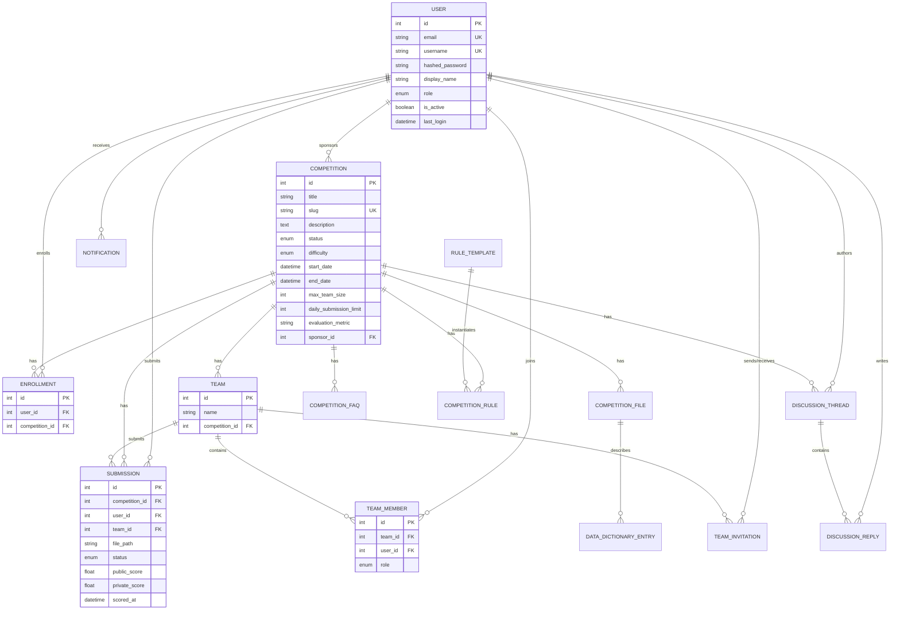
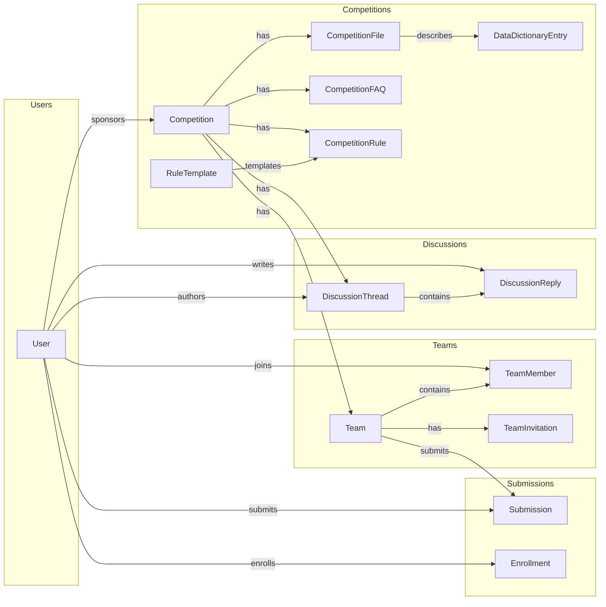

# Database Schema

PostgreSQL database with 15 tables organized around competitions, users, teams, and content.

## Entity Relationship Diagram

## Core Tables

### users

Primary user account table.

| Column | Type | Constraints |
|--------|------|-------------|
| id | INTEGER | PK, auto-increment |
| email | VARCHAR(255) | UNIQUE, NOT NULL |
| username | VARCHAR(100) | UNIQUE, NOT NULL |
| hashed_password | VARCHAR(255) | NOT NULL |
| display_name | VARCHAR(255) | NOT NULL |
| role | ENUM | `PARTICIPANT`, `SPONSOR`, `ADMIN` |
| is_active | BOOLEAN | DEFAULT TRUE |
| last_login | TIMESTAMP | NULLABLE |
| created_at | TIMESTAMP | DEFAULT NOW() |
| updated_at | TIMESTAMP | DEFAULT NOW() |

### competitions

Competition definitions and configuration.

| Column | Type | Constraints |
|--------|------|-------------|
| id | INTEGER | PK |
| title | VARCHAR(255) | NOT NULL, indexed |
| slug | VARCHAR(255) | UNIQUE, indexed |
| description | TEXT | NOT NULL |
| short_description | VARCHAR(500) | NULLABLE |
| status | ENUM | `DRAFT`, `ACTIVE`, `EVALUATION`, `COMPLETED`, `ARCHIVED` |
| difficulty | ENUM | `BEGINNER`, `INTERMEDIATE`, `ADVANCED` |
| start_date | TIMESTAMP | NOT NULL |
| end_date | TIMESTAMP | NOT NULL |
| max_team_size | INTEGER | DEFAULT 1 |
| daily_submission_limit | INTEGER | DEFAULT 5 |
| evaluation_metric | VARCHAR(50) | NOT NULL |
| evaluation_description | TEXT | NULLABLE |
| is_public | BOOLEAN | DEFAULT TRUE |
| solution_path | VARCHAR(500) | NULLABLE |
| thumbnail_path | VARCHAR(500) | NULLABLE |
| sponsor_id | INTEGER | FK → users |
| created_at | TIMESTAMP | DEFAULT NOW() |
| updated_at | TIMESTAMP | DEFAULT NOW() |

### submissions

User/team predictions for scoring.

| Column | Type | Constraints |
|--------|------|-------------|
| id | INTEGER | PK |
| competition_id | INTEGER | FK → competitions, indexed |
| user_id | INTEGER | FK → users, indexed |
| team_id | INTEGER | FK → teams, NULLABLE, indexed |
| file_path | VARCHAR(500) | NOT NULL |
| file_name | VARCHAR(255) | NOT NULL |
| status | ENUM | `PENDING`, `PROCESSING`, `SCORED`, `FAILED` |
| public_score | FLOAT | NULLABLE |
| private_score | FLOAT | NULLABLE |
| error_message | TEXT | NULLABLE |
| scored_at | TIMESTAMP | NULLABLE |
| created_at | TIMESTAMP | DEFAULT NOW() |
| updated_at | TIMESTAMP | DEFAULT NOW() |

## Team Tables

### teams

Team entity for team competitions.

| Column | Type | Constraints |
|--------|------|-------------|
| id | INTEGER | PK |
| name | VARCHAR(100) | NOT NULL |
| competition_id | INTEGER | FK → competitions |
| created_at | TIMESTAMP | DEFAULT NOW() |
| updated_at | TIMESTAMP | DEFAULT NOW() |

**Constraints:** UNIQUE(name, competition_id)

### team_members

Junction table for team membership.

| Column | Type | Constraints |
|--------|------|-------------|
| id | INTEGER | PK |
| team_id | INTEGER | FK → teams |
| user_id | INTEGER | FK → users |
| role | ENUM | `LEADER`, `MEMBER` |
| created_at | TIMESTAMP | DEFAULT NOW() |
| updated_at | TIMESTAMP | DEFAULT NOW() |

**Constraints:** UNIQUE(team_id, user_id)

### team_invitations

Pending team invitations.

| Column | Type | Constraints |
|--------|------|-------------|
| id | INTEGER | PK |
| team_id | INTEGER | FK → teams, indexed |
| inviter_id | INTEGER | FK → users, indexed |
| invitee_id | INTEGER | FK → users, indexed |
| status | ENUM | `PENDING`, `ACCEPTED`, `DECLINED`, `EXPIRED` |
| expires_at | TIMESTAMP | NOT NULL |
| created_at | TIMESTAMP | DEFAULT NOW() |
| updated_at | TIMESTAMP | DEFAULT NOW() |

**Constraints:** UNIQUE(team_id, invitee_id, status)

## Enrollment

### enrollments

Tracks user registration for competitions.

| Column | Type | Constraints |
|--------|------|-------------|
| id | INTEGER | PK |
| user_id | INTEGER | FK → users |
| competition_id | INTEGER | FK → competitions |
| created_at | TIMESTAMP | DEFAULT NOW() |
| updated_at | TIMESTAMP | DEFAULT NOW() |

**Constraints:** UNIQUE(user_id, competition_id)

## Discussion Tables

### discussion_threads

Competition discussion topics.

| Column | Type | Constraints |
|--------|------|-------------|
| id | INTEGER | PK |
| competition_id | INTEGER | FK → competitions |
| author_id | INTEGER | FK → users |
| title | VARCHAR(200) | NOT NULL |
| content | TEXT | NOT NULL |
| is_pinned | BOOLEAN | DEFAULT FALSE |
| is_locked | BOOLEAN | DEFAULT FALSE |
| created_at | TIMESTAMP | DEFAULT NOW() |
| updated_at | TIMESTAMP | DEFAULT NOW() |

### discussion_replies

Replies to discussion threads.

| Column | Type | Constraints |
|--------|------|-------------|
| id | INTEGER | PK |
| thread_id | INTEGER | FK → discussion_threads, CASCADE |
| author_id | INTEGER | FK → users |
| content | TEXT | NOT NULL |
| created_at | TIMESTAMP | DEFAULT NOW() |
| updated_at | TIMESTAMP | DEFAULT NOW() |

## Notification

### notifications

User notification inbox.

| Column | Type | Constraints |
|--------|------|-------------|
| id | INTEGER | PK |
| user_id | INTEGER | FK → users, indexed |
| type | ENUM | See notification types below |
| title | VARCHAR(255) | NOT NULL |
| message | TEXT | NOT NULL |
| link | VARCHAR(500) | NULLABLE |
| is_read | BOOLEAN | DEFAULT FALSE, indexed |
| read_at | TIMESTAMP | NULLABLE |
| created_at | TIMESTAMP | DEFAULT NOW() |
| updated_at | TIMESTAMP | DEFAULT NOW() |

**Notification Types:**
- `SUBMISSION_SCORED`, `SUBMISSION_FAILED`
- `COMPETITION_UPDATE`, `COMPETITION_STARTED`, `COMPETITION_ENDING`
- `DISCUSSION_REPLY`, `DISCUSSION_MENTION`
- `TEAM_INVITATION`, `TEAM_MEMBER_JOINED`, `TEAM_REMOVED`, `TEAM_LEADERSHIP`
- `SYSTEM`

## Competition Content Tables

### competition_files

Files associated with competitions (datasets, samples).

| Column | Type | Constraints |
|--------|------|-------------|
| id | INTEGER | PK |
| competition_id | INTEGER | FK → competitions, indexed, CASCADE |
| filename | VARCHAR(255) | NOT NULL |
| display_name | VARCHAR(255) | NULLABLE |
| purpose | TEXT | NULLABLE |
| file_path | VARCHAR(500) | NOT NULL |
| file_size | BIGINT | NULLABLE |
| file_type | VARCHAR(50) | NULLABLE |
| variable_notes | TEXT | NULLABLE |
| created_at | TIMESTAMP | DEFAULT NOW() |
| updated_at | TIMESTAMP | DEFAULT NOW() |

### data_dictionary_entries

Column definitions for CSV files.

| Column | Type | Constraints |
|--------|------|-------------|
| id | INTEGER | PK |
| file_id | INTEGER | FK → competition_files, indexed, CASCADE |
| column_name | VARCHAR(255) | NOT NULL |
| definition | TEXT | NULLABLE |
| encoding | TEXT | NULLABLE |
| display_order | INTEGER | DEFAULT 0 |
| created_at | TIMESTAMP | DEFAULT NOW() |
| updated_at | TIMESTAMP | DEFAULT NOW() |

### competition_faqs

Frequently asked questions for competitions.

| Column | Type | Constraints |
|--------|------|-------------|
| id | INTEGER | PK |
| competition_id | INTEGER | FK → competitions, indexed, CASCADE |
| question | VARCHAR(500) | NOT NULL |
| answer | TEXT | NOT NULL |
| display_order | INTEGER | DEFAULT 0 |
| created_at | TIMESTAMP | DEFAULT NOW() |
| updated_at | TIMESTAMP | DEFAULT NOW() |

## Rules Tables

### rule_templates

Reusable rule templates with optional parameters.

| Column | Type | Constraints |
|--------|------|-------------|
| id | INTEGER | PK |
| category | VARCHAR(50) | indexed |
| title | VARCHAR(255) | DEFAULT '' |
| template_text | TEXT | NOT NULL |
| has_parameter | BOOLEAN | DEFAULT FALSE |
| parameter_type | VARCHAR(20) | NULLABLE (`number`, `date`, `text`) |
| parameter_label | VARCHAR(100) | NULLABLE |
| display_order | INTEGER | DEFAULT 0 |
| created_at | TIMESTAMP | DEFAULT NOW() |
| updated_at | TIMESTAMP | DEFAULT NOW() |

### competition_rules

Competition-specific rule instances.

| Column | Type | Constraints |
|--------|------|-------------|
| id | INTEGER | PK |
| competition_id | INTEGER | FK → competitions, indexed, CASCADE |
| rule_template_id | INTEGER | FK → rule_templates, SET NULL |
| is_enabled | BOOLEAN | DEFAULT TRUE |
| parameter_value | VARCHAR(255) | NULLABLE |
| custom_title | VARCHAR(255) | NULLABLE |
| custom_text | TEXT | NULLABLE |
| display_order | INTEGER | DEFAULT 0 |
| created_at | TIMESTAMP | DEFAULT NOW() |
| updated_at | TIMESTAMP | DEFAULT NOW() |

## Key Relationships

## Indexes

| Table | Indexed Columns |
|-------|-----------------|
| users | email, username |
| competitions | title, slug |
| submissions | competition_id, user_id, team_id |
| team_invitations | team_id, inviter_id, invitee_id |
| notifications | user_id, is_read |
| competition_files | competition_id |
| data_dictionary_entries | file_id |
| competition_faqs | competition_id |
| competition_rules | competition_id |
| rule_templates | category |

## Cascade Policies

| Parent | Child | On Delete |
|--------|-------|-----------|
| Competition | CompetitionFile | CASCADE |
| Competition | CompetitionRule | CASCADE |
| Competition | CompetitionFAQ | CASCADE |
| CompetitionFile | DataDictionaryEntry | CASCADE |
| CompetitionRule | RuleTemplate | SET NULL |
| Team | TeamMember | CASCADE |
| Team | TeamInvitation | CASCADE |
| DiscussionThread | DiscussionReply | CASCADE |
