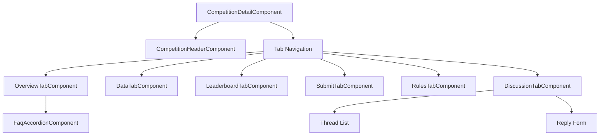
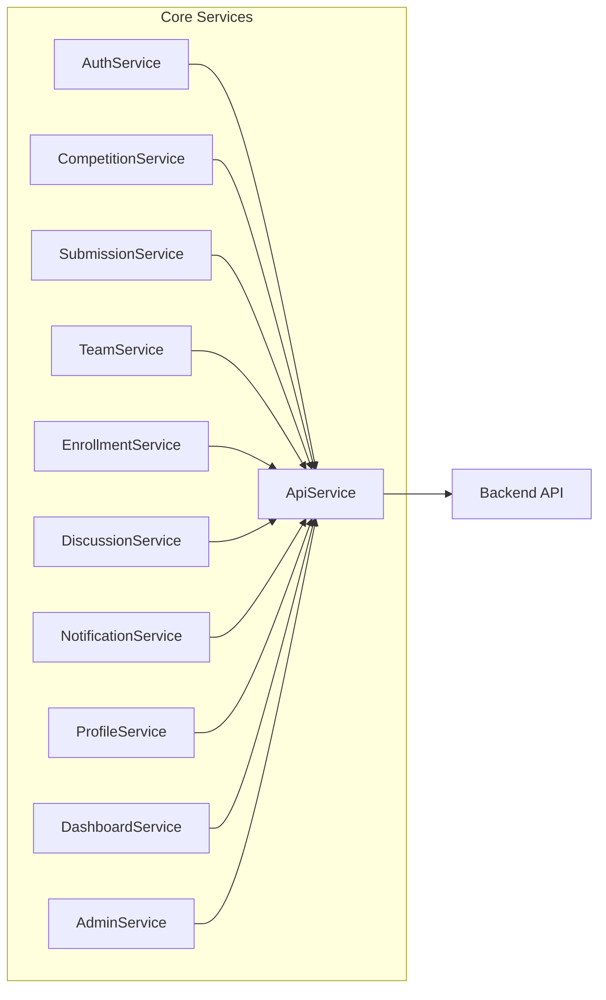
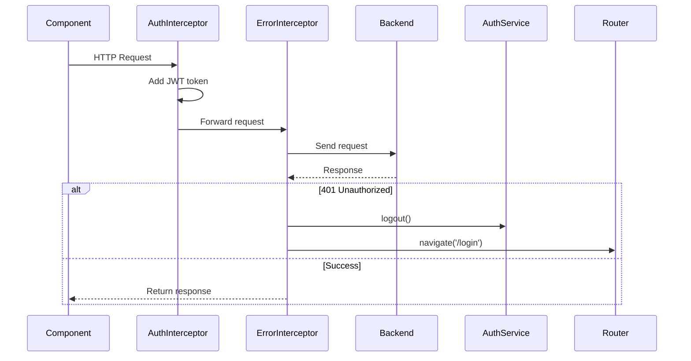
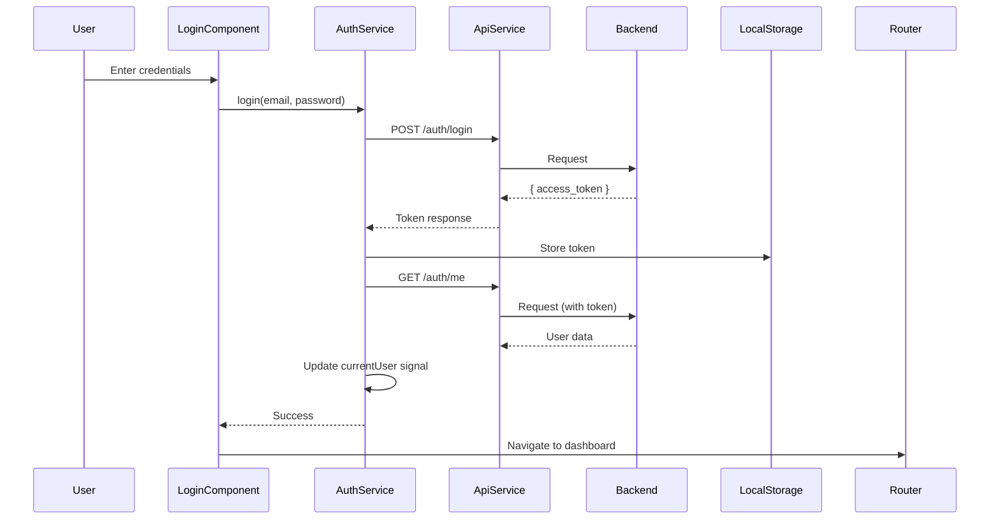
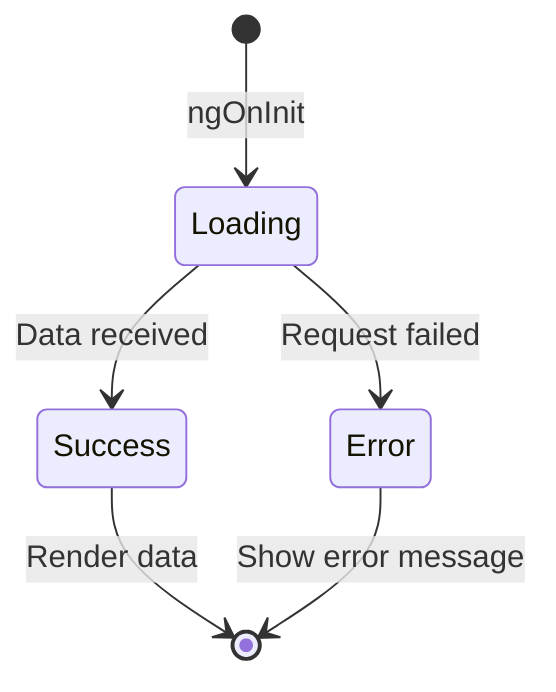

# Frontend Architecture

Angular 18 application with standalone components, lazy-loaded routes, and signal-based reactivity.

## Technology Stack

| Technology | Purpose |
|------------|---------|
| Angular 18 | Frontend framework |
| Angular Material | UI component library |
| RxJS | Async operations |
| Signals | Reactive state management |

## Application Structure

```
frontend/src/app/
├── core/                    # Shared services, models, interceptors
│   ├── interceptors/        # HTTP interceptors (auth, error)
│   ├── models/              # TypeScript interfaces
│   └── services/            # API services
├── layout/                  # App shell components
│   ├── layout/              # Root layout wrapper
│   ├── header/              # Navigation header
│   └── footer/              # Page footer
└── pages/                   # Feature pages (lazy-loaded)
    ├── home/                # Landing page
    ├── auth/                # Login, register
    ├── dashboard/           # User dashboard
    ├── profile/             # User profiles
    ├── competitions/        # Competition features
    └── not-found/           # 404 page
```

## Routing Overview

```mermaid
flowchart TB
    subgraph Layout["LayoutComponent (Shell)"]
        Header[HeaderComponent]
        RouterOutlet[Router Outlet]
        Footer[FooterComponent]
    end

    RouterOutlet --> Home["/  HomeComponent"]
    RouterOutlet --> Login["/login  LoginComponent"]
    RouterOutlet --> Register["/register  RegisterComponent"]
    RouterOutlet --> Dashboard["/dashboard  DashboardComponent"]
    RouterOutlet --> CompList["/competitions  CompetitionListComponent"]
    RouterOutlet --> CompCreate["/competitions/create  CompetitionCreateComponent"]
    RouterOutlet --> CompDetail["/competitions/:slug  CompetitionDetailComponent"]
    RouterOutlet --> CompEdit["/competitions/:slug/edit  CompetitionEditComponent"]
    RouterOutlet --> Profile["/users/:username  ProfileComponent"]
    RouterOutlet --> NotFound["/**  NotFoundComponent"]
```



All routes are children of `LayoutComponent`, which provides the header, footer, and main content area.

## Competition Detail Component

The competition detail page uses a tabbed interface to organize content:



## Core Services



### Service Responsibilities

| Service | Purpose |
|---------|---------|
| **ApiService** | Base HTTP client with typed methods (get, post, patch, delete, upload) |
| **AuthService** | Login, logout, registration, current user state |
| **CompetitionService** | Competition CRUD, file uploads, truth sets |
| **SubmissionService** | Submit predictions, fetch leaderboard |
| **TeamService** | Team creation, member management, invitations |
| **EnrollmentService** | Enroll/withdraw from competitions |
| **DiscussionService** | Threads, replies, comments |
| **NotificationService** | User notifications, mark read |
| **ProfileService** | User profiles and stats |
| **DashboardService** | Dashboard aggregated data |
| **AdminService** | User management, platform stats |

## HTTP Interceptors



### AuthInterceptor
- Reads JWT from localStorage
- Adds `Authorization: Bearer {token}` header to all requests

### ErrorInterceptor
- Catches 401 responses
- Triggers logout and redirects to login page
- Re-throws errors for component-level handling

## Authentication Flow



## State Management

The application uses Angular Signals for reactive state:

```typescript
// AuthService
currentUser = signal<User | null>(null);
isAuthenticated = computed(() => this.currentUser() !== null);

// NotificationService
unreadCount = signal<number>(0);

// HeaderComponent
mobileMenuOpen = signal(false);
```

### Component Data Loading Pattern



Components typically manage three states:
- `loading: boolean` - Show spinner
- `data: T | null` - The fetched data
- `error: string | null` - Error message

## Key Architectural Decisions

| Decision | Rationale |
|----------|-----------|
| Standalone components | Eliminates NgModule boilerplate |
| Lazy loading | Reduces initial bundle size |
| Signals over Subjects | Simpler reactive patterns |
| Inline templates | Keeps component code together |
| No state library | Keeps architecture simple |
| Material Design | Consistent, accessible UI |
| JWT in localStorage | Simple token persistence |

## File Organization

Each feature follows this pattern:

```
pages/competitions/
├── competition-list/
│   └── competition-list.component.ts
├── competition-detail/
│   ├── competition-detail.component.ts
│   ├── competition-header/
│   │   └── competition-header.component.ts
│   └── tabs/
│       ├── overview-tab.component.ts
│       ├── data-tab.component.ts
│       └── ...
├── competition-create/
│   └── competition-create.component.ts
└── competition-edit/
    └── competition-edit.component.ts
```
